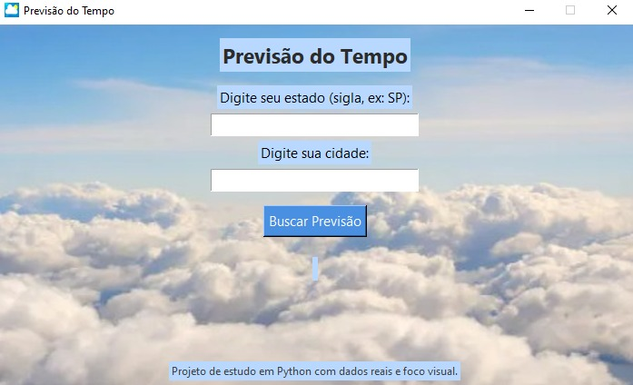
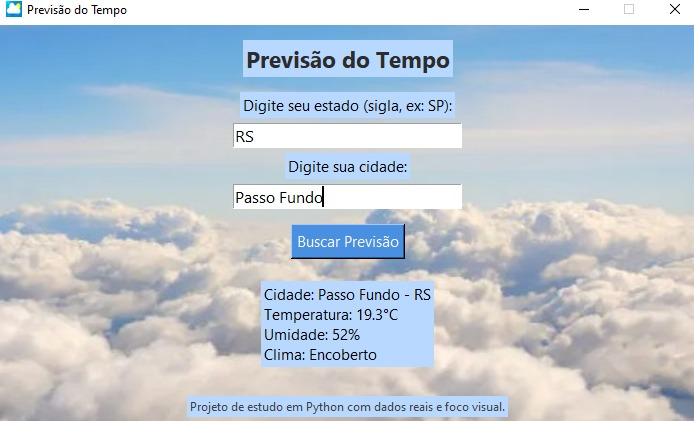

### 🌤️ Previsão do Tempo com Python + Tkinter

Este é um aplicativo de previsão do tempo desenvolvido em Python com interface gráfica feita em Tkinter.  
Ele permite que o usuário digite a cidade e a sigla do estado desejado (ex: `Campinas`, `SP`) e, com base nesses dados, o app exibe:
- Temperatura atual 🌡️
- Umidade relativa do ar 💧 
- Condição climática atual (ex: céu limpo, nublado, chuva, etc) ⛅

---

## 🎯 Objetivo do Projeto:

Este projeto foi desenvolvido com o intuito de praticar habilidades em:

- Consumo de **API externa (Open-Meteo)**
- Manipulação de **requisições HTTP com `requests`**
- Criação de interface amigável com **Tkinter**
- Leitura e exibição de **dados em tempo real**

A proposta visual foi pensada para tornar a experiência intuitiva, informativa e agradável ao usuário.

---

## 💻 Tecnologias Usadas:

- Python 3  
- Tkinter  
- Requests  
- Pillow (PIL)  
- API Open-Meteo    
- `try/except` para tratamento de erros

---

## 🤍 Sobre:

Desenvolvido por Jamile Rockenbach Ferreira, estudante de Ciência da Computação como parte dos estudos pessoais de Python e interfaces gráficas.
Um projeto simples, mas poderoso, que une API + GUI de forma didática e funcional, ideal para quem deseja ver como Python pode ser usado para criar aplicações visuais úteis.

---

## ☁️ Interface:

